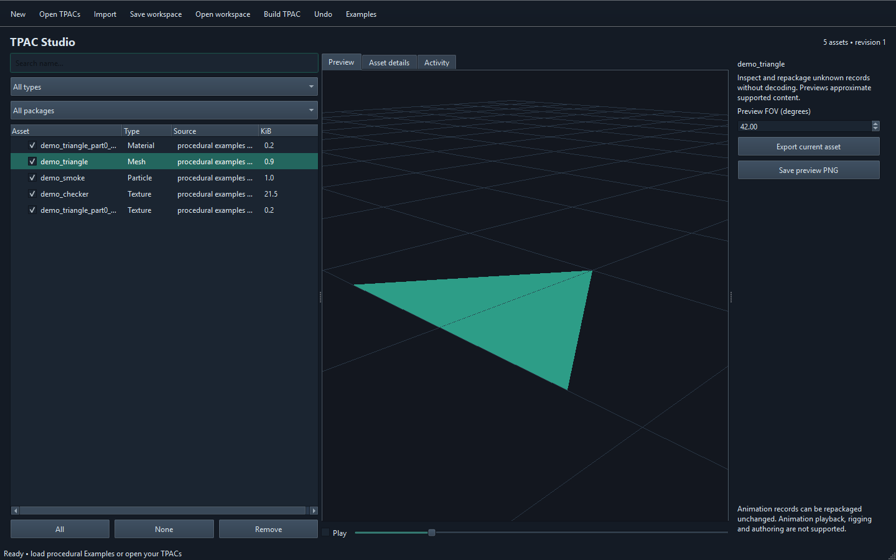

# TPAC Studio

**Inspect, organize and rebuild TPAC packages through a desktop application, Python, JSON CLI or MCP.**

TPAC Studio **1.0.0** is an independent community tool by **X7 Dragon** for working with Mount & Blade II: Bannerlord asset packages. It is not affiliated with or endorsed by TaleWorlds Entertainment.



## Features

| Task | Support |
| --- | --- |
| Open and browse packages | TPAC container versions 1 and 2; names, types, GUIDs, segments and source packages |
| Merge and remove assets | Workspace selection, explicit conflict policies, session undo and reviewed build plans |
| Preserve unfamiliar records | Opaque metadata and stored segments, including animation records, can be repackaged without decoding |
| Texture preview/import | Supported 2D formats; image import creates RGBA mipmaps; PNG export |
| Static model preview/import | Supported mesh layouts; geometry JSON, plus optional Blender for OBJ/FBX/glTF/BLEND |
| Particle preview/edit | Approximate sprite playback and scrubbing; opacity, size, emission and lifetime multipliers for supported layouts |
| Save work | Self-contained `.tpstudio` workspaces with concurrent-save detection |
| Automate | Shared Python service, structured JSON CLI, local stdio MCP and opt-in Python extensions |

Previews use an independent renderer and approximate in-game appearance. Dependency discovery is incomplete, so test rebuilt packages in the game before replacing production assets. Animation playback, character preview, rigging and animation authoring are not supported. Static model imports use constant base colours rather than full material graphs. See [supported formats](docs/formats.md) for details.

## Windows application

1. Download `TPAC-Studio-1.0.0-windows-x64.zip` from [Releases](https://github.com/gedizz/TPAC-Studio/releases).
2. Extract the entire ZIP to a folder.
3. Run `TPACStudio.exe` inside the extracted folder. Keep `_internal` alongside the executable.
4. Click **Examples** to try the tool with original procedural assets, or **Open TPACs** to browse your packages.

The Windows app includes its Python and Qt runtime. Python, Blender and Bannerlord are not required to start it. Blender is optional for static OBJ/FBX/glTF/BLEND import. The GUI requires a functioning OpenGL compatibility context.

## Install from source

Python **3.12+** is required. From the repository folder in PowerShell:

```powershell
py -3.12 -m venv .venv
.\.venv\Scripts\python.exe -m pip install --upgrade pip
.\.venv\Scripts\python.exe -m pip install ".[gui,mcp]"
.\.venv\Scripts\tpac-studio-gui.exe
```

Use `python -m pip install .` for the headless Python API and JSON CLI. The GUI is tested on Windows; see [validation](docs/validation.md) for platform coverage. [Building](docs/building.md) covers development installs, dependencies, tests and executable generation.

## Build a package

1. Open one or more TPACs, or load **Examples**.
2. Select a row to inspect it. Use checkboxes to choose the assets to build; **Remove** removes a workspace record.
3. Use **Save workspace** to resume later.
4. Click **Build TPAC**, review the assets and dependency findings, then choose a new output filename.

The writer verifies stored output records before committing the output file. It refuses to overwrite original package inputs, including when overwrite is explicitly enabled. Repackaging does not automatically update module XML or references from other packages.

## Python

```python
from tpac_studio.service import Studio

studio = Studio(root="./user-data")
try:
    studio.examples_load()
    plan = studio.build_plan()
    print(studio.build_execute("example.tpac", plan["plan_id"]))
finally:
    studio.close()
```

Run [examples/build_demo.py](examples/build_demo.py) for a complete example. The [API guide](docs/api.md) explains error envelopes, revisions, imports, selection and builds.

## Use with AI

Launch `tpac-studio-mcp --root <your-asset-folder>` from an MCP-capable host, or have an agent use the JSON CLI. Start with `capabilities` and `schemas`, inspect inputs, make explicit edits, review `build_plan`, then call `build_execute` with that plan's ID. The [AI guide](docs/ai.md) includes MCP configuration and example prompts.

The MCP server uses local stdio and owns a separate workspace. Save and reopen a workspace to exchange work between the GUI and an agent session.

## Documentation

- [Desktop guide](docs/user-guide.md)
- [Python / JSON API](docs/api.md) and [operation reference](docs/api-reference.md)
- [AI / MCP guide](docs/ai.md)
- [Extensions](docs/extensions.md)
- [Formats and limitations](docs/formats.md)
- [Directory and architecture map](docs/architecture.md)
- [Build and release guide](docs/building.md)
- [Format references](docs/format-references.md), [third-party notices](THIRD_PARTY_NOTICES.md) and [validation](docs/validation.md)
- [Contributing](CONTRIBUTING.md), [security](SECURITY.md) and [agent instructions](AGENTS.md)

## License

Original code and documentation are licensed under **MIT**, copyright **2026 X7 Dragon**. Adapted TpacTool format work retains its MIT attribution. Dependencies and user-provided assets retain their own licenses. See [LICENSE](LICENSE), [NOTICE](NOTICE) and [LICENSES](LICENSES/README.md).
